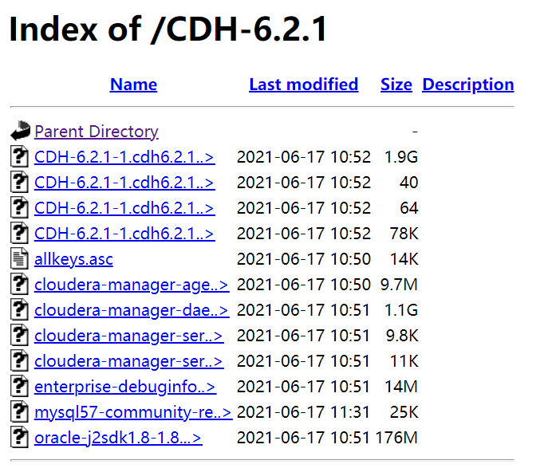
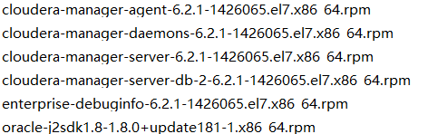
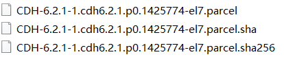
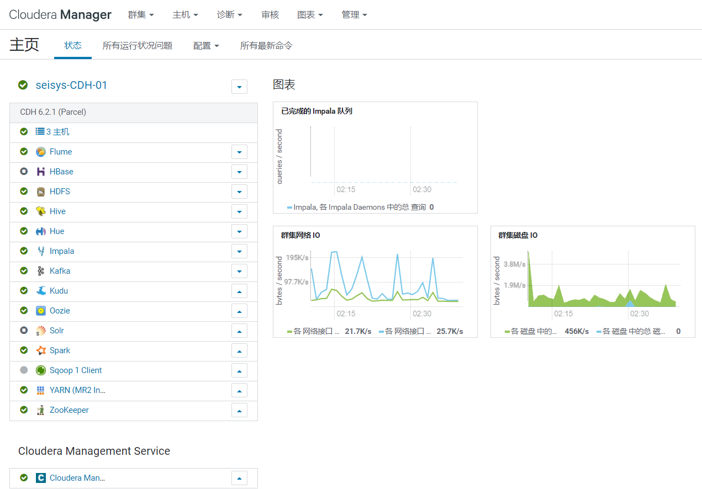
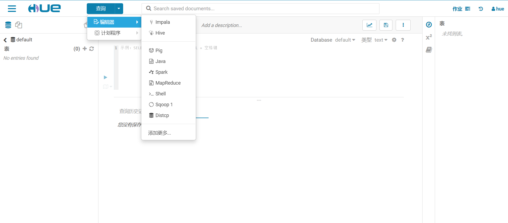

# CDH 6.2.1 安装手册

## 前言

> CDH是[Cloudera公司](https://www.cloudera.com/)对应Hadoop的一个发行版本，具有易于安装、部署、操作、图形化界面等特点。
>
> 该文档致力于指导首次接触到CDH平台的新手快速部署一个CDH大数据平台

- Cloudera官方文档
  - https://www.cloudera.com/documentation/enterprise/latest.html 
- B站教程链接链接：https://www.bilibili.com/video/BV1PT4y1J7nW?from=search&seid=5121942211484400693
- 所需安装包地址( ==内网访问== )
  * http://10.4.1.201/CDH-6.2.1/



## 环境准备

1. **操作系统安装 Centos 7+  (略)**

2. **修改 yum 默认源 （以网易163源为例）所有节点执行**

   ```sh
   cd /etc/yum.repos.d/ && wget -c http://mirrors.163.com/.help/CentOS7-Base-163.repo
   mv /etc/yum.repos.d/CentOS-Base.repo /etc/yum.repos.d/CentOS-Base.repo.backup
   mv CentOS7-Base-163.repo  CentOS-Base.repo
   yum clean all
   yum makecache
   ```

3. **yum 安装必要软件**  

   ```sh
   yum install -y cyrus-sasl-plain cyrus-sasl-gssapi portmap fuse-libs bind-utils libxslt fuse
   yum install -y /lib/lsb/init-functions createrepo deltarpm python-deltarpm
   yum install -y mod_ssl openssl-devel python-psycopg2 MySQL-python
   ```

4. **安装httpd 服务   master节点安装即可**

   ```shell
   yum install httpd
   yum install createrepo
   ```

5. **Hostname 配置**

   ```shell
   #设置主机名称：hostnamectl set-hostname  主机名称
   #配置hosts
   cat >>test <<- EOF
   $ip1 $node1
   $ip2 $node2
   $ip3 $node3
   EOF
   ```

​       注：windows 同理：C:\Windows\System32\drivers\etc\hosts

6. **配置节点之间的免密登陆**

   ```shell
   ##配置免密登录
   ssh-keygen -t rsa         #所有节点执行,一路回车无需设置密码
   ssh-copy-id $node1        #将公钥复制到远程机器中 所有节点执行
   ssh-copy-id $node2
   ssh-copy-id $node3
   ```

7. **时钟同步 所有节点执行**

   ```shell
   ##时钟同步
   yum -y install ntp 
   systemctl start ntpd 
   systemctl disable chrony 
   systemctl enable ntpd
   vim /etc/ntp.conf 
   在文件中添加：restrict  10.4.1.0  mask  255.255.255.0  nomodify  notrap
   注释一下内容
   #server  0.centos.pool.ntp.org
   #server  1.centos.pool.ntp.org
   #server  2.centos.pool.ntp.org
   #server  3.centos.pool.ntp.org
   去掉以下注释：没有的话就添加
   server   127.127.1.0 
   fudge    127.127.1.0  stratum  10
   确保bios与系统时间同步
   vim /etc/sysconfig/ntpd 
   添加：SYNC_HWLOCK=yes
   其余机器与node1同步 
   crontab -e
   */1 * * * * /usr/sbin/ntpdate 10.4.1.xxx
   ```

8. **关闭防火墙**

   ```shell
   systemctl status firewalld.service
   systemctl stop firewalld.service
   systemctl disable firewalld.service
   #关闭selinux
   vim /etc/selinux/config
   修改:SELINUX=disabled
   重启：reboot
   ```

9. **master 节点启动httpd服务**

   ```shell
   systemctl start httpd.service
   cd /var/www/html/
   mkdir -p cm6/6.2.1/redhat7/yum/RPMS/x86_64/ 
   ```

10.**上传以下文件到目录： /var/www/html/cm6/6.2.1/redhat7/yum/RPMS/x86_64/**



11. **上传秘钥文件   allkeys.asc  到目录：/var/www/html/cm6/6.2.1/**

12. **测试访问地址**：http://node1/cm6/6.2.1/redhat7/yum/RPMS/x86_64/

    ```sh
    cd /var/www/html/cm6/6.2.1/redhat7/yum
    createrepo .
    ```

13. **配置本地yum源**

    ```shell
    cd /etc/yum.repos.d/
    
    cat >>/etc/yum.repos.d/cloudera-manager.repo <<-EOF
    [cloudera-manager]
    name=Cloudera Manager
    baseurl=http://seisys.hadoop01/cm6/6.2.1/redhat7/yum/
    gpgcheck=0
    enabled=1
    EOF
    
    yum clean all
    yum list | grep cloudera
    ```

14. **创建cloudera-scm用户**

    ```shell
    useradd cloudera-scm
    passwd cloudera-scm
    #>pwd: seisyscdh2021    #输入密码
    #授予root权限
    echo "cloudera-scm ALL=(root)NOPASSWD:ALL" >> /etc/sudoers
    ```

15. **安装mysql服务,后续作为元数据库使用。 只在master 节点安装即可**。

    ```sh
    yum -y install wget
    wget -c -i http://dev.mysql.com/get/mysql57-community-release-el7-10.noarch.rpm #可自行下载上传
    yum -y install mysql57-community-release-el7-10.noarch.rpm
    yum -y install mysql-community-server
    systemctl start mysqld.service  #启动mysql服务
    #查看mysql初始密码
    grep "password" /var/log/mysqld.log
    #登陆
    mysql -uroot -p密码
    #取消mysql密码规范限制
    set global validate_password_policy=0;
    set global validate_password_length=1;
    #重设密码：
    alter user 'root'@'localhost' identified by '123456';
    flush privileges;
    
    #创建数据库存储元数据：hive hue oozie 。。。
    create database hive DEFAULT CHARSET utf8 COLLATE utf8_general_ci;
    create database hue DEFAULT CHARSET utf8 COLLATE utf8_general_ci;
    create database oozie DEFAULT CHARSET utf8 COLLATE utf8_general_ci;
    
    #设置mysql远程登陆权限
    create database scm DEFAULT CHARACTER SET utf8;
    grant all PRIVILEGES on *.* TO 'root'@'%' IDENTIFIED BY '123456' WITH GRANT OPTION;
    grant all PRIVILEGES on *.* TO 'root'@'localhost' IDENTIFIED BY '123456' WITH GRANT OPTION;
    grant all PRIVILEGES on *.* TO 'root'@'hadoop01' IDENTIFIED BY '123456' WITH GRANT OPTION;
    flush privileges;
    #卸载repo包
    yum -y remove mysql57-community-release-el7-10.noarch 避免每次更新耗费时间
    ```

16. L**inux 配置优化   所有节点执行**

    ```shell
     #虚拟内存设置
     echo "vm.swappiness=10" >> /etc/sysctl.conf  
     #关闭内存动态分配
     echo "echo never > /sys/kernel/mm/transparent_hugepage/defrag" >> /etc/rc.local
     echo "echo never > /sys/kernel/mm/transparent_hugepage/enabled" >> /etc/rc.local
     
     #设置最大文件句柄数及最大派生数：
     vim   /etc/security/limits.conf
    添加以下内容*表示所有用户：
    * hard nofile 50000
    * soft nofile 50000
    * hard  nproc  10000
    * soft  nproc  10000
    
    #TCP socket 端口数
    sudo sysctl -w net.ipv4.ip_local_port_range ="10000 65000" 
    #缩减Socket 闲置时间
    sudo sysctl -w net.ipv4.netfilter.ip_conntrack_tcp_timeout_time_wait ="1"
    
    echo "vm.swappiness=10" >> /etc/sysctl.conf
    echo "echo never > /sys/kernel/mm/transparent_hugepage/defrag" >> /etc/rc.local
    echo "echo never > /sys/kernel/mm/transparent_hugepage/enabled" >> /etc/rc.local
    ```

    

17. **安装CM server 和agent  仅在 Master 服务器安装即可**

    ```sh
    yum install -y oracle-j2sdk1.8-1.8.0+update181-1.x86_64
    yum install -y enterprise-debuginfo-6.2.1-1426065.el7.x86_64
    yum install -y cloudera-manager-server-6.2.1-1426065.el7.x86_64
    yum install -y cloudera-manager-server-db-2-6.2.1-1426065.el7.x86_64
    #重新初始化
    cd /var/www/html/cm6/6.2.1/redhat7/yum && rm -rf repodata  && createrepo .
    systemctl restart httpd.service
    yum clean all
    ```

18. **设置元数据库为 mysql**  

    - 上传mysql 驱动包jar到/opt/cloudera/cm/lib目录下

    ```shell
    #执行以下命令
    /opt/cloudera/cm/schema/scm_prepare_database.sh -h localhost mysql scm root 123456
    #启动server服务进程
    systemctl start cloudera-scm-server
    #查看启动状态
    systemctl status cloudera-scm-server  
    #查看端口号是否已经存在 
    netstat -an | grep 7180 
    ```

19.  **配置本地parcel包**

    

    - 将以上 parcel 文件上传到/ opt/cloudera/parcel-repo 目录中。

20.  **开始图形界面安装**
     访问连接          http://主机名:7180/cmf/login                 账号密码均为 admin  

## CDH大数据平台的使用说明

##### :sailboat:   **关于本次安装的CDH大数据平台说明**

###### 基础配置

|   CDH版本    |    V6.2.1     |
| :----------: | :-----------: |
|  **CM版本**  |  **V6.2.1**   |
| **操作系统** | **Centos7.9** |
|   **内存**   |    **16G**    |
|   **存储**   |   **2T/台**   |
| **节点数量** |     **3**     |

[^注]: ==由于资源有限仅用于测试环境下使用==

:small_airplane:   **已安装的组件**



:blush:   **CDH组件服务说明**

:palm_tree:   Cloudera  Manager 访问地址： http://10.4.1.201:7180   用户名：admin  密码：admin

:evergreen_tree:    数据仓库 Hive 连接地址  

|    Host    |    Passwd     |
| :--------: | :-----------: |
| 10.4.1.201 | seisys@123456 |

交互平台HUE   访问地址:  http://10.4.1.201:8888  or  http://10.4.1.202:8889       账号：hue   密码： hue  



:smiley_cat:  **好了，现在你可以感受下CDH的魅力了**